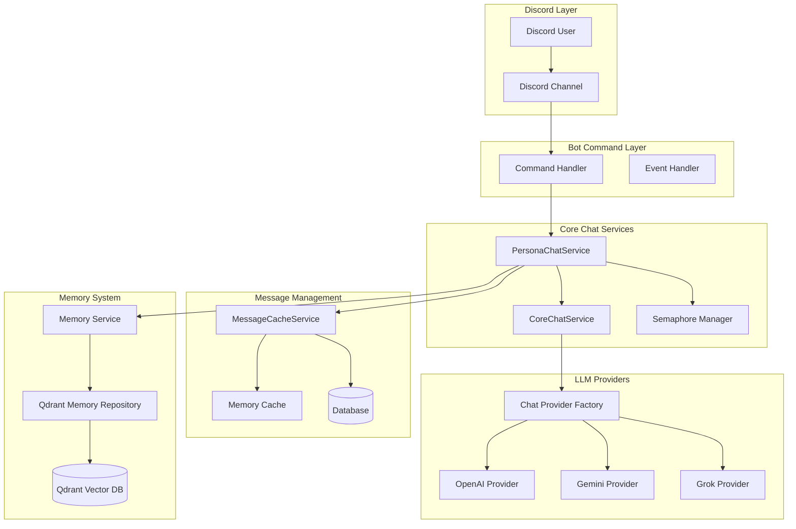
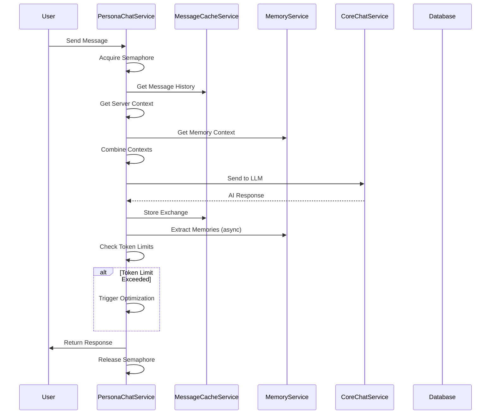
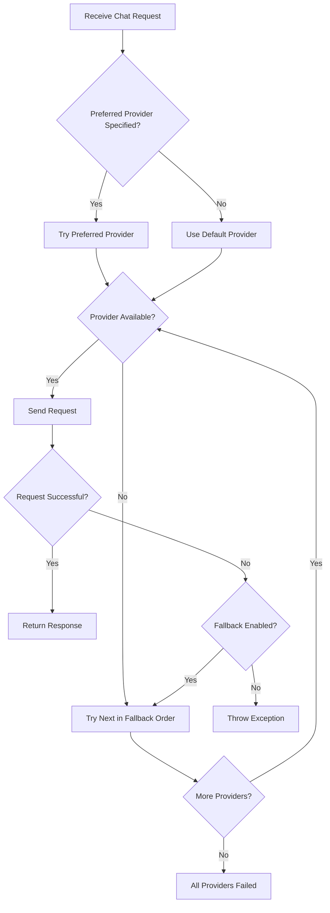
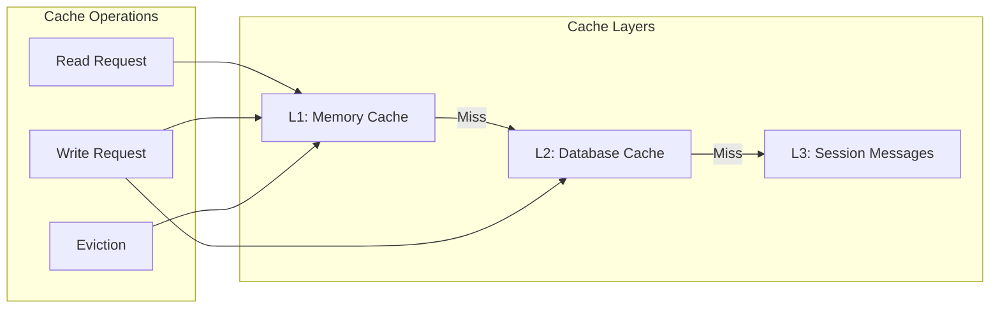
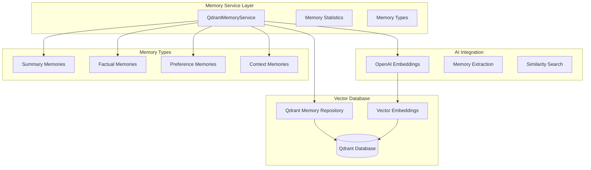
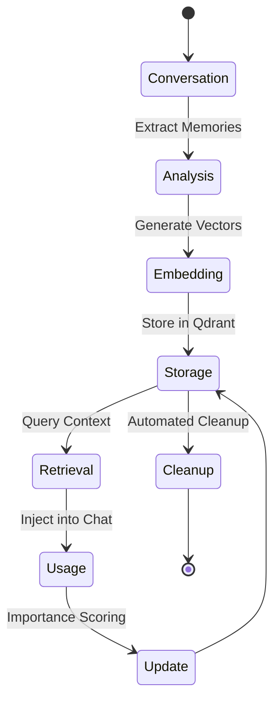
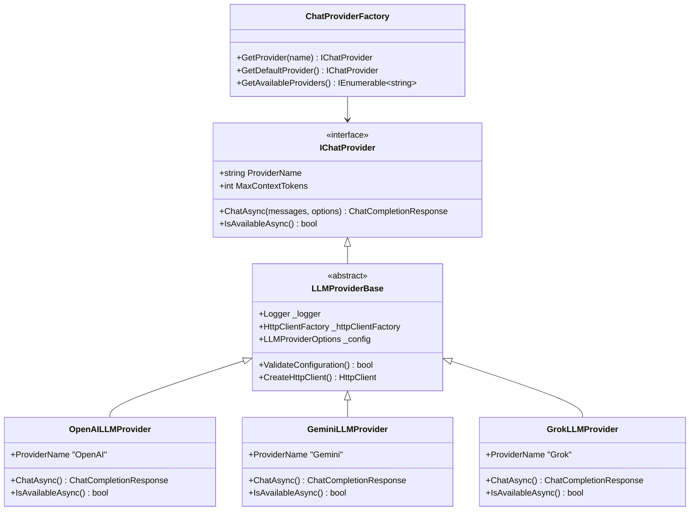
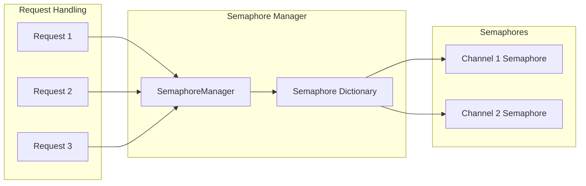
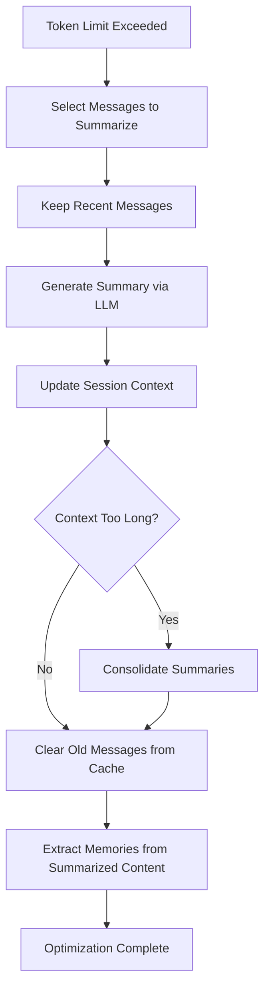

# Conversation System Architecture

The Amiquin conversation system is a sophisticated, multi-layered architecture designed to handle Discord bot conversations with AI-powered responses, memory persistence, and efficient message management. This document provides a comprehensive overview of the entire conversation pipeline, from Discord message reception to AI response generation and memory storage.

## System Overview

The conversation system consists of several interconnected components working together to provide intelligent, context-aware chat experiences:



## Core Components

### 1. PersonaChatService

The `PersonaChatService` is the primary orchestrator for Discord chat interactions. It manages the entire conversation flow from message reception to response delivery.

**Key Responsibilities:**

- **Conversation Orchestration**: Coordinates the entire chat pipeline
- **Concurrency Control**: Manages semaphores to prevent duplicate requests
- **Context Assembly**: Combines server persona, session context, and memory context
- **History Management**: Triggers automatic optimization when token limits approach
- **Memory Integration**: Extracts and retrieves conversation memories
- **Error Handling**: Provides graceful degradation and error recovery

**Core Methods:**

```csharp
Task<string> ChatAsync(ulong instanceId, ulong userId, ulong botId, string message)
Task<string> ExchangeMessageAsync(ulong instanceId, string message)
Task<(bool success, string message)> TriggerHistoryOptimizationAsync(ulong instanceId)
```

**Chat Flow Process:**



### 2. CoreChatService

The `CoreChatService` handles provider selection, fallback logic, and direct LLM communication.

**Key Features:**

- **Provider Abstraction**: Unified interface for multiple AI providers
- **Automatic Fallback**: Seamlessly switches providers on failure
- **System Message Management**: Builds and manages system prompts
- **Token Management**: Handles token limits and optimization
- **Request Types**: Supports both stateless core requests and stateful chat requests

**Methods:**

```csharp
Task<ChatCompletionResponse> CoreRequestAsync(string prompt, string? customPersona, int tokenLimit, string? provider)
Task<ChatCompletionResponse> ChatAsync(ulong instanceId, List<SessionMessage> messages, string? customPersona, string? sessionContext, string? provider)
```

**Provider Fallback Logic:**



### 3. Message Caching System

The `MessageCacheService` provides efficient in-memory caching with database persistence for conversation history.

**Architecture Components:**

- **IMemoryCache**: ASP.NET Core memory cache for fast access
- **Database Persistence**: Long-term storage with Entity Framework
- **Session Integration**: Links with active chat sessions
- **Automatic Expiration**: Configurable cache expiration policies

**Caching Strategy:**



**Key Methods:**

```csharp
Task<List<ChatMessage>?> GetOrCreateChatMessagesAsync(ulong serverId)
Task AddChatExchangeAsync(ulong serverId, List<ChatMessage> messages, List<Message> modelMessages)
void ClearOldMessages(ulong instanceId, int range)
int GetChatMessageCount(ulong instanceId)
```

### 4. Memory System Integration

The memory system provides long-term conversation memory using vector embeddings and semantic search.

**Memory Architecture:**



**Memory Operations:**

- **Creation**: Automatic extraction from conversations with importance scoring
- **Retrieval**: Semantic search based on current query context
- **Cleanup**: Automated removal of old or low-importance memories
- **Statistics**: Comprehensive tracking of memory usage and effectiveness

**Memory Lifecycle:**



### 5. LLM Provider Architecture

The provider system offers a unified interface for multiple AI services with automatic fallback and configuration management.

**Provider Hierarchy:**



**Provider Configuration:**

- **Unified Configuration**: Consistent settings across all providers
- **Model-Specific Settings**: Per-model temperature, token limits, system messages
- **Fallback Orders**: Configurable provider priority chains
- **Health Checking**: Automatic availability validation

## Advanced Features

### Concurrency Control

The system implements sophisticated concurrency control to handle multiple simultaneous conversations:

**Semaphore Management:**



**Key Benefits:**

- **Per-Channel Isolation**: Each Discord channel has its own semaphore
- **Duplicate Prevention**: Silently skips rapid duplicate requests
- **Resource Protection**: Prevents concurrent LLM requests for same context
- **Memory Safety**: Ensures thread-safe message cache operations

### History Optimization

Automatic conversation history optimization prevents token limit exceeded errors:

**Optimization Triggers:**

- Token usage exceeds 40% of maximum limit
- Manual optimization via admin commands
- Configurable thresholds per server

**Optimization Process:**



### Error Handling and Resilience

The conversation system implements comprehensive error handling:

**Error Recovery Strategies:**

- **Provider Fallback**: Automatic switching to backup providers
- **Graceful Degradation**: Fallback to basic responses when AI unavailable
- **Request Queuing**: Intelligent request management during high load
- **Cache Resilience**: Multiple fallback layers for message retrieval

**Monitoring and Observability:**

- **Structured Logging**: Comprehensive logging with Serilog
- **Token Usage Tracking**: Detailed cost and usage analytics
- **Performance Metrics**: Response times and success rates
- **Health Checks**: Regular system health validation

## Configuration

### Core Settings

```json
{
  "LLM": {
    "DefaultProvider": "OpenAI",
    "GlobalSystemMessage": "You are Amiquin, a helpful Discord bot.",
    "GlobalTemperature": 0.6,
    "GlobalTimeout": 30,
    "EnableFallback": true,
    "FallbackOrder": ["OpenAI", "Gemini", "Grok"],
    "Providers": {
      "OpenAI": {
        "Enabled": true,
        "ApiKey": "sk-...",
        "BaseUrl": "https://api.openai.com/v1",
        "Models": {
          "gpt-4": {
            "MaxTokens": 8192,
            "MaxOutputTokens": 2048,
            "Temperature": 0.7
          }
        }
      }
    }
  },
  "Memory": {
    "Enabled": true,
    "EmbeddingModel": "text-embedding-3-small",
    "MaxContextMemories": 5,
    "MaxMemoryTokens": 1000,
    "SimilarityThreshold": 0.7,
    "MinImportanceScore": 0.3,
    "AutoCleanup": true,
    "MemoryRetentionDays": 30
  },
  "Bot": {
    "MaxTokens": 4096,
    "MessageFetchCount": 50
  }
}
```

### Environment Variables

```env
# Discord Bot Configuration
AMQ_Bot__Token=your_discord_bot_token

# LLM Provider Configuration
AMQ_LLM__Providers__OpenAI__ApiKey=sk-your-openai-key
AMQ_LLM__Providers__OpenAI__Model=gpt-4
AMQ_LLM__DefaultProvider=OpenAI

# Memory System Configuration
AMQ_Memory__Enabled=true
AMQ_Memory__Qdrant__Host=localhost
AMQ_Memory__Qdrant__Port=6334

# Database Configuration
AMQ_Database__Mode=0
AMQ_Database__ConnectionString=Server=localhost;Database=amiquin;User=root;Password=password;
```

## Performance Optimization

### Caching Strategies

1. **L1 Cache (Memory)**: Immediate access to recent conversations
2. **L2 Cache (Database)**: Session-based message persistence
3. **L3 Cache (Vector)**: Semantic memory for long-term context

### Token Management

- **Dynamic Limits**: Adaptive token limits based on provider capabilities
- **Smart Summarization**: Intelligent conversation compression
- **Context Optimization**: Selective message inclusion based on relevance

### Asynchronous Processing

- **Background Memory Extraction**: Non-blocking memory processing
- **Parallel Provider Requests**: Concurrent availability checking
- **Deferred Cleanup**: Scheduled maintenance operations

## Monitoring and Debugging

### Logging Levels

```csharp
// Information Level - Normal operation
_logger.LogInformation("Chat completed for instance {InstanceId}", instanceId);

// Warning Level - Recoverable issues  
_logger.LogWarning("Provider {Provider} is not available", providerName);

// Error Level - Serious failures
_logger.LogError(ex, "Failed to get response from provider {Provider}", providerName);

// Debug Level - Detailed diagnostics
_logger.LogDebug("Generated memory context with {Count} memories", contextParts.Count);
```

### Metrics Collection

The system automatically tracks:

- **Token Usage**: Per-request and aggregate consumption
- **Response Times**: End-to-end conversation latency
- **Provider Success Rates**: Fallback effectiveness metrics
- **Memory Efficiency**: Retrieval accuracy and usage patterns
- **Cache Hit Rates**: Caching effectiveness across all layers

### Health Checks

Regular health validation includes:

- **Database Connectivity**: EF Core connection health
- **Vector Database Status**: Qdrant cluster health
- **Provider Availability**: AI service status checks
- **Memory Cache Status**: Cache size and efficiency metrics

## Best Practices

### Development Guidelines

1. **Always Use Dependency Injection**: All services are registered via DI container
2. **Implement Proper Disposal**: Use `using` statements for scoped services
3. **Handle Exceptions Gracefully**: Provide meaningful fallbacks
4. **Log Comprehensively**: Include context and correlation IDs
5. **Test Provider Fallbacks**: Validate failover scenarios

### Configuration Management

1. **Environment-Specific Settings**: Use different configs per environment
2. **Secret Management**: Never commit API keys or sensitive data
3. **Feature Toggles**: Use configuration to enable/disable features
4. **Performance Tuning**: Monitor and adjust token limits and cache sizes

### Memory System Usage

1. **Importance Scoring**: Set appropriate thresholds for memory creation
2. **Regular Cleanup**: Schedule automated cleanup jobs
3. **Monitor Vector Storage**: Track Qdrant disk usage and performance
4. **Embedding Costs**: Be mindful of OpenAI embedding API usage

## Troubleshooting

### Common Issues

#### High Token Usage

**Symptoms**: Frequent optimization triggers, high API costs
**Solutions**:

- Reduce `MessageFetchCount`
- Increase optimization threshold
- Implement smarter message filtering

#### Memory System Performance

**Symptoms**: Slow response times, Qdrant errors
**Solutions**:

- Check Qdrant cluster health
- Validate embedding generation
- Review memory cleanup settings

#### Provider Failures

**Symptoms**: Consistent fallback usage, error responses
**Solutions**:

- Verify API keys and quotas
- Check provider-specific rate limits
- Review network connectivity

### Diagnostic Commands

```bash
# Check conversation system health
curl -X GET "http://localhost:5000/health/conversation"

# Monitor token usage
tail -f /app/data/logs/amiquin-*.log | grep "Token Usage"

# Validate Qdrant connection
curl -X GET "http://localhost:6333/collections/amiquin_memories"

# Check provider availability
docker-compose exec amiquin dotnet run --project Amiquin.Bot -- --check-providers
```

## Integration Examples

### Custom Provider Implementation

```csharp
public class CustomLLMProvider : LLMProviderBase
{
    public override string ProviderName => "CustomProvider";

    public CustomLLMProvider(
        ILogger<CustomLLMProvider> logger,
        IHttpClientFactory httpClientFactory,
        IOptions<LLMProviderOptions> config,
        IOptions<LLMOptions> globalConfig)
        : base(logger, httpClientFactory, config.Value, globalConfig.Value)
    {
    }

    public override async Task<ChatCompletionResponse> ChatAsync(
        IEnumerable<SessionMessage> messages,
        ChatCompletionOptions options)
    {
        // Custom implementation
    }

    public override async Task<bool> IsAvailableAsync()
    {
        // Health check implementation
    }
}
```

### Memory Extension

```csharp
public class CustomMemoryExtractor : IMemoryExtractor
{
    public async Task<List<QdrantMemory>> ExtractMemoriesAsync(
        string sessionId,
        List<SessionMessage> messages)
    {
        // Custom memory extraction logic
        var memories = new List<QdrantMemory>();
        
        // Analyze messages for custom patterns
        foreach (var message in messages.Where(m => m.Role == "user"))
        {
            if (IsImportantContent(message.Content))
            {
                var memory = await CreateMemoryAsync(
                    sessionId, 
                    message.Content, 
                    "custom_type");
                    
                memories.Add(memory);
            }
        }
        
        return memories;
    }
}
```

---

## Conclusion

The Amiquin conversation system represents a sophisticated approach to AI-powered chat bot architecture, combining efficient caching, intelligent memory management, and robust provider abstraction. The system is designed for scalability, maintainability, and extensibility, making it suitable for both development and production environments.

The modular architecture allows for easy customization and extension, while the comprehensive error handling and monitoring ensure reliable operation in real-world scenarios. Whether you're contributing to the project or building upon it, this documentation provides the foundation for understanding and working with the conversation system effectively.
